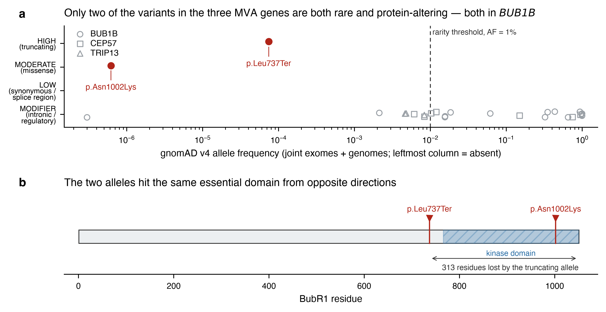

# MVA Hackathon 2026 — Track 1 (Variant Prediction)

**Team Axolotl** · model: *HPO-anchored targeted panel with ACMG/AMP evidence weighting*

A reproducible pipeline that goes from a single-sample GRCh38 WGS callset plus a
list of HPO terms to a ranked Track 1 submission file, with every annotation
value pulled from free public APIs and cached on disk.

> Research and bioinformatic interpretation. Not a clinical diagnostic report.
> Any clinical decision must be made by the responsible medical team with access
> to the full patient context and confirmed in an accredited laboratory.

## Result

The proband is a **candidate compound heterozygote in *BUB1B***, i.e. mosaic
variegated aneuploidy type 1 (MVA1, OMIM 257300, autosomal recessive):

| | Allele 1 | Allele 2 |
|---|---|---|
| GRCh38 | chr15:40,209,701 T>G | chr15:40,220,612 T>G |
| HGVS (NM_001211.6 / ENST00000287598) | `c.2210T>G` · `p.Leu737Ter` | `c.3006T>G` · `p.Asn1002Lys` |
| dbSNP | rs759242053 | — |
| Consequence | `stop_gained` (HIGH) | `missense_variant` (MODERATE) |
| Genotype · DP / GQ / allele balance | 0/1 · 46× / 99 / 0.54 | 0/1 · 28× / 99 / 0.46 |
| gnomAD v4 joint | AF 7.43 × 10⁻⁵, 0 hom | AF 6.19 × 10⁻⁷, 0 hom |
| ClinVar | VCV000533901 **Pathogenic/Likely pathogenic**, 2★ | absent |
| SIFT / PolyPhen-2 | n/a (truncating) | deleterious / probably damaging |
| phyloP100way | 2.91 | 4.80 |

*CEP57* and *TRIP13* are negative. No nephrocalcinosis gene shows a biallelic
genotype; one monoallelic *SLC34A1* variant is submitted as a low-ranked
secondary finding, explicitly as a possible modifier and not as a cause.

Phase is **not** demonstrated — the two alleles are 10,911 bp apart with no
`PGT`/`PID` phase set — which is why the primary EPCR is 0.85 and not higher.
Parental Sanger segregation is the decisive missing test.



## Quickstart

```bash
git clone <this repo> && cd mva-track1-axolotl
python -m pip install -e ".[dev]"        # Python >= 3.10
python -m pytest                         # 30 offline unit tests, no network needed

# put the challenge VCF (+ .tbi) here; it is git-ignored on purpose
mkdir -p data && cp /path/to/WGS_EX2312012_HGWCNDSX7.vcf.gz* data/

python -m mva_track1 --vcf data/WGS_EX2312012_HGWCNDSX7.vcf.gz --out results
```

`make test run` does the same. Optional: `pip install pysam` for indexed random
access instead of one streaming pass over the bgzipped file — the pipeline picks
whichever is available and the results are identical.

Two useful flags:

```bash
# what the UNATTENDED pipeline would submit, scoring EPCR with a transparent
# heuristic instead of the expert-reviewed values recorded in the config
python -m mva_track1 --vcf data/... --out results-heuristic --heuristic-epcr

# disable the on-disk annotation cache (not recommended; it is what makes
# a re-run reproducible rather than merely repeatable)
python -m mva_track1 --vcf data/... --cache-dir ""
```

## What the pipeline does

1. **Phenotype → gene sets.** The eight HPO terms are read as one cluster, not
   eight independent queries. Cancer predisposition + IUGR/postnatal growth
   failure + parental recurrent pregnancy loss is the signature of a
   chromosomal-instability syndrome, which resolves to the three genes with
   definitive validity for MVA (*BUB1B*, *CEP57*, *TRIP13*). Congenital
   nephrocalcinosis, the one feature MVA does not explain, gets its own
   seven-gene panel. **This step was expert reasoning, not an algorithm** — it is
   recorded as data in `config/panels.yaml` so everything downstream is
   deterministic.
2. **Interval extraction.** Ensembl REST supplies GRCh38 coordinates and the
   canonical transcript; every VCF record within gene span ± 5 kb is extracted.
3. **Genotype and QC.** `FORMAT`/sample fields → zygosity, depth, genotype
   quality, allele balance from `AD`, and phase fields. QC gate: `FILTER=PASS`,
   DP ≥ 10, GQ ≥ 30, plus an allele-balance sanity check keyed to the called
   zygosity (a "heterozygote" at AB 0.05 is not one).
4. **Annotation.** Ensembl VEP (canonical-transcript consequence, SIFT,
   PolyPhen-2), gnomAD v4 per-allele AC/AN/homozygote counts and gene
   constraint, ClinVar classification + review status + derived star rating,
   UCSC phyloP100way conservation.
5. **HGVS, recomputed not trusted.** `c.` positions are derived arithmetically
   from the canonical transcript's own CDS exon structure. The implied protein
   position is cross-checked against the one VEP returns independently and a
   mismatch raises `AssertionError` rather than a warning.
6. **Inheritance models.** Per gene: is there a rare damaging homozygous
   genotype, and are there two distinct rare damaging heterozygous variants?
   Candidate pairs are emitted as single rows. Pairs that the VCF's own physical
   phasing places *in cis* are rejected, not reported.
7. **Submission.** Rows written in descending EPCR order to
   `Axolotl_targeted-panel-vep-gnomad-acmg.csv`.

## Outputs

| File in `results/` | Contents |
|---|---|
| `Axolotl_targeted-panel-vep-gnomad-acmg.csv` | The submission: 3 ranked rows (2 primary, 1 secondary) |
| `mva_bub1b_candidates.png` | The submitted figure, regenerated from the tables |
| `annotated_candidate_variants.csv` | Every annotated variant with genotype, QC, VEP, SIFT/PolyPhen, phyloP, gnomAD, ClinVar, candidate flags |
| `recessive_models.csv` | Per-gene verdict on homozygosity and compound heterozygosity |
| `compound_het_pairs.csv` | Candidate pairs with phase status and the reason for it |
| `gene_variants_qc.tsv` | All 714 extracted variants with genotype and QC metrics |
| `gene_constraint.csv` | gnomAD pLI, LOEUF, o/e and z-scores for the ten genes |
| `cds_structure.json` | Canonical transcript, CDS length and exon count per gene |

## Reproducibility

* **Verified end-to-end run** on the challenge VCF: 714 variants extracted from
  the ten gene intervals, 685 passing QC, `BUB1B` → *compound heterozygous
  candidate*, all other nine genes → *negative*. Every evidence value quoted in
  the table above is read back from `results/`, not from notes.
* **Annotation cache.** Each API response is stored under `.cache/annotations/`
  keyed by request. A re-run makes zero network calls and cannot drift when a
  public database is updated. Delete the directory to refresh against live data.
* **Deterministic EPCR.** `config/panels.yaml` records the exact submitted rows,
  so `python -m mva_track1 ...` regenerates the submitted CSV. `--heuristic-epcr`
  shows what the unattended pipeline would have produced instead — the two are
  kept separate rather than blurred.
* **Tests.** 30 offline unit tests cover VCF left-trimming and the Ensembl
  region/allele representation of SNVs, insertions, deletions and MNVs; `c.`/`p.`
  derivation on both strands, checked against ClinVar's own title for
  `c.2210T>G (p.Leu737Ter)`; zygosity and allele-balance logic; and the
  recessive-model decisions including cis rejection and trans recognition.

## Honest notes

* **Hybrid, not fully automated.** The candidate set, all annotation values, the
  zygosity/QC calls and the biallelic verdicts are pipeline output. The choice of
  which rows to submit, the ACMG/AMP criteria and the EPCR values were assigned
  by expert review. No annotation value was hand-edited.
* **CADD and REVEL were unreachable** from our environment; functional-impact
  prediction rests on SIFT, PolyPhen-2 and phyloP100way. Stated rather than
  papered over.
* **SNV/indel only.** The input VCF carries no structural variants, so a
  structural second hit in *CEP57* or *TRIP13* would have been missed.
* **Ten genes, not exome-wide.** This is a targeted hypothesis test, by design.
* **Annotation is restricted to `FILTER=PASS` records**, so the per-gene variant
  counts in `recessive_models.csv` are one lower for *BUB1B* than the raw
  extraction count in `gene_variants_qc.tsv`. Candidate calls are unaffected.
* **ClinVar access differs from our original run.** The submission was produced
  with ClinVar read through the gnomAD mirror; this repo queries NCBI
  E-utilities directly, which is the better source. Both return
  VCV000533901 Pathogenic/Likely pathogenic at 2 stars. Set `NCBI_EMAIL` (and
  optionally `NCBI_API_KEY`) to identify yourself as NCBI requests; the client
  omits the field when unset rather than sending a placeholder.

## Repository layout

```
config/panels.yaml            HPO terms, gene panels, thresholds, submitted rows
src/mva_track1/
  config.py                   config loading
  vcf_extract.py              interval extraction, zygosity, QC
  hgvs.py                     left-trimming, VEP region/allele, c./p. derivation
  annotate.py                 Ensembl, gnomAD, ClinVar, UCSC clients + cache
  inheritance.py              homozygous / compound-het logic, phase
  submission.py               EPCR and submission writer
  figure.py                   the two-panel figure
  pipeline.py                 orchestration
  cli.py                      command-line entry point
tests/                        30 offline unit tests + CDS fixture
```

## Data availability

No patient data is committed and none can be: `.gitignore` excludes `*.vcf*`,
`*.bam`, `*.cram`, `data/`, `results/` and `.cache/`. The challenge VCF must be
obtained from the organisers and placed in `data/`.

## Sources

Ensembl REST · gnomAD v4 GraphQL · NCBI E-utilities (ClinVar) · UCSC Genome
Browser API · Human Phenotype Ontology. All public, all keyless. No proprietary
data.

## License

MIT — see `LICENSE`.
